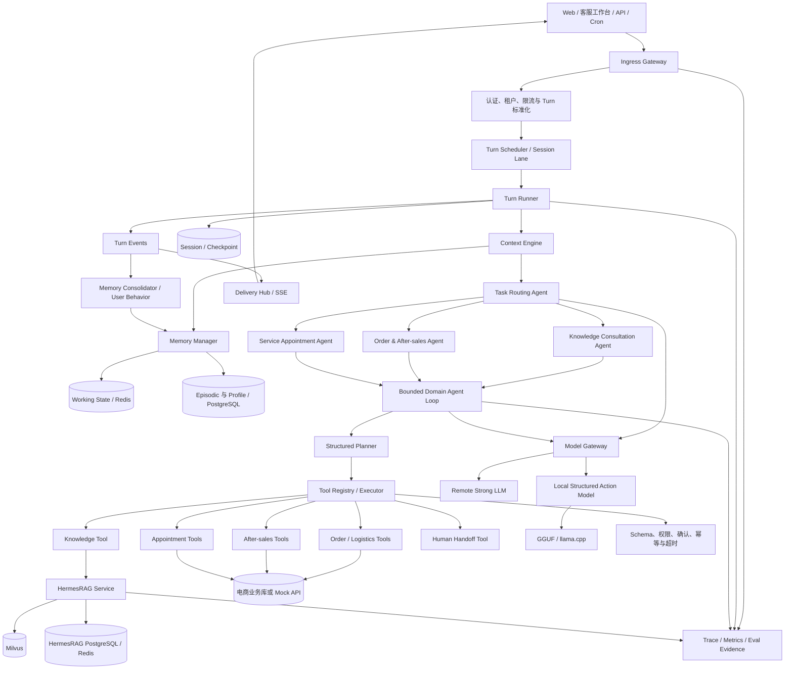
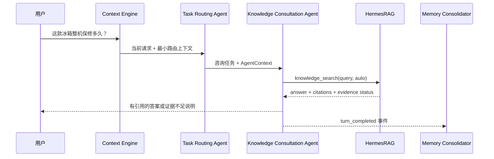
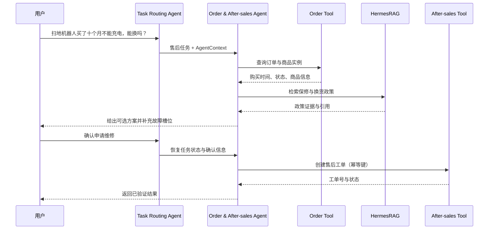

# JakePilot 电商售后 Agent 架构设计

- 状态：设计基线 v6；阶段一至三、后台 Memory Consolidator 及人工接管的本地演示闭环已实现，阶段四已完成正式评测开发门禁与本地管理员观测页；阶段五已完成结构化契约、数据门禁、组件评测和 Shadow/回退运行边界，真实训练、量化与正式 Golden Set 运行尚未完成
- 日期：2026-09-17
- 目标读者：项目开发者、技术面试官、评测人员
- 设计基线：保留 JakePilot 原有的中心路由式多 Agent 框架，在共享 Runtime 中补充 Context Engine、分层记忆、有界执行、Checkpoint 与 Trace；HermesRAG 作为独立知识检索服务

### 0.1 当前实施快照（2026-09-20）

| 模块 | 当前状态 | 可验证证据 | 尚未完成 |
|---|---|---|---|
| 中心路由与订单售后闭环 | 已实现演示闭环 | 结构化 Planner、6 步上限、订单/物流/退货工具、写前确认、幂等写入、SSE 事件与自动化测试 | 组合意图通用调度、生产级 Session Lane |
| HermesRAG Knowledge Tool | 已实现适配器 | Auto/Agentic 请求、证据与引用状态映射、超时降级、本地知识回退 | 生产鉴权、跨服务 Trace 统一存储 |
| 分层记忆与上下文 | 已实现 MVP | Working/Episodic/Profile 存储、任务恢复、上下文预算、任务终止清理、后台 Memory Consolidator、敏感门禁与幂等版本链 | 规模化召回评测、可选模型提取器对照 |
| Checkpoint 与 Delivery | 已实现安全投影 | Turn 运行/终止/投递状态分离、断线标记、按会话查询 | 完整断点续跑、外部消息投递重试 |
| Human Handoff | 已实现演示闭环 | 显式转人工路由、隐私最小化工单、幂等持久化、`handed_off` 终态、SSE 事件和管理员安全投影 | 客服受理/完结工作流、生产通知渠道与 SLA |
| 评测与观测 | 已实现开发门禁 | 离线 Smoke Case、多领域冻结 Case 契约、三次重复运行、确定性断言、Semantic Judge 隔离、不可变 Evidence Store、CI 证据门禁与 `/admin/observability` 本地观测页 | 200 条经人工审核的正式 Golden Set、真实 Baseline 与候选版本重复对比报告 |
| 预约结构化模型后训练 | 运行与评测骨架已实现 | 不可变决策契约、业务 Guard、三态网关、数据隐私/泄漏校验、组件指标、正式证据门禁与安全 SSE Trace | 合规数据构建、SFT/DPO、GGUF 量化、本地服务和真实冻结集报告 |

当前演示仍使用 SQLite 和本机访问控制。`/admin/observability` 是本地展示入口，不等同于生产 JWT/RBAC；正式部署前仍需完成 Ingress Gateway、租户鉴权、PostgreSQL/Redis 迁移和审计策略。

## 1. 项目定义

JakePilot 是一个面向电商售后场景的 Agent 服务平台。系统沿用原项目“任务路由 Agent + 领域 Agent”的中心化多 Agent 结构，在商品与政策咨询、订单查询、退换货办理、上门安装或维修预约之间识别意图并完成受控协作。知识类问题由 HermesRAG 提供有证据、有引用、可追踪的回答；订单、退款、预约等实时事实通过业务工具查询和修改；共享 Context Engine 与记忆系统为各 Agent 提供当前任务状态、历史事件摘要和稳定偏好，但不替代订单系统等事实源。

### 1.1 目标用户

- 电商平台消费者：咨询商品、订单、物流、售后政策和上门服务。
- 客服或售后人员：查看 Agent 执行轨迹、接管异常任务、处理转人工工单。
- 系统管理员：维护知识库、工具配置、权限和评测数据。

### 1.2 核心业务闭环

1. **商品与政策咨询**：回答商品使用、保修、退换货条件等问题并给出引用。
2. **订单与物流查询**：读取实时订单、支付和物流状态，不从记忆中猜测。
3. **退换货办理**：结合订单事实与政策证据判断资格，补齐原因、凭证等槽位，确认后创建售后单。
4. **上门服务预约**：针对安装、检测或维修，收集商品、地址区域、时间和服务类型，匹配可用时段并确认预约。

## 2. 范围与非范围

### 2.1 本期范围

- 基于结构化输出的意图识别和任务规划。
- 单意图与组合意图请求，例如“查物流，如果明天还不到就申请退款”。
- HermesRAG 知识检索工具，支持回答、引用、证据状态和 Trace 回传。
- 订单、物流、售后、预约、转人工等确定性工具。
- 写操作确认、幂等、超时、重试、失败回滚和安全降级。
- Working、Episodic、Profile 三层业务记忆。
- 上下文预算、记忆召回解释和全链路可观测性。
- 离线评测集与端到端任务评测。
- 面向预约 Agent 的本地结构化决策模型后训练，用于槽位抽取和下一动作选择，并保留强模型安全回退。

### 2.2 明确不做

- 不对通用对话、RAG 生成或整体 Agent 规划模型做全量微调；后训练仅限预约 Agent 的本地结构化决策模型。
- 不将 HermesRAG 的向量检索代码复制到 JakePilot 内部。
- 不让多个 Agent 自由聊天或无限循环协商。
- 不用记忆替代订单、物流、库存、退款等实时业务系统。
- 不自动执行付款、退款、取消订单等写操作，除非用户已确认且权限校验通过。
- 不保存银行卡号、证件原文、完整支付凭证等高敏感信息。
- 不在用户界面暴露模型隐藏思维链，只展示计划摘要、工具状态、证据和结果。

## 3. 架构原则

1. **Agent 决策，Tool 执行**：模型负责理解、规划和解释；确定性工具负责读取或修改业务状态。
2. **RAG 是知识工具**：HermesRAG 只解决知识证据问题，不承担订单和退款事实查询。
3. **事实源优先**：实时业务数据始终覆盖历史记忆和模型推断。
4. **写操作可控**：所有有副作用的操作经过权限、参数、确认和幂等检查。
5. **有界执行**：计划步数、工具重试、RAG 补检和模型调用都有上限。
6. **记忆可解释**：每条记忆可追溯到来源、时间、置信度和写入原因。
7. **降级而非伪造**：外部服务失败时返回可解释状态、追问或转人工，不伪造成功结果。
8. **统一 Turn 契约**：Web、API、定时任务和人工接管都转换为同一种 Turn，由同一 Runtime 调度。
9. **执行与投递解耦**：Turn 完成不等于消息已经送达；运行终态、流式投递和重试分别管理。
10. **外部内容不可信**：历史消息、记忆、知识片段和工具返回都作为数据注入，不允许覆盖系统规则或权限边界。
11. **上下文与记忆共享**：领域 Agent 不各自维护长期记忆，由 Context Engine 和 Memory Manager 统一读取、筛选、注入与持久化。

## 4. 总体架构



### 4.1 服务边界

| 服务 | 负责 | 不负责 |
|---|---|---|
| JakePilot | 会话、意图、任务计划、工具编排、状态、记忆、确认、异常恢复 | 文档切分、向量召回、RAG 重排 |
| HermesRAG | 文档入库、混合检索、Agentic 补检、证据判断、引用验证、RAG Trace | 订单读取、退款写入、预约落库 |
| 电商业务工具层 | 订单、物流、售后单、服务时段等事实读写 | 自然语言推理和政策解释 |
| Task Routing Agent | 识别单意图或组合意图、选择领域 Agent、管理结构化交接 | 直接执行订单、售后和预约写操作 |
| Domain Agents | 在咨询、订单售后和服务预约边界内规划并调用获授权工具 | 各自保存一套长期记忆或绕过统一权限门禁 |
| Memory Manager | 任务状态、事件摘要、稳定偏好的写入与按需召回 | 作为订单状态或政策事实源 |
| Context Engine | 按目标 Agent 组装任务状态、相关记忆、历史和实时 Observation | 产生业务结论或自主修改长期记忆 |
| Ingress Gateway | 身份校验、限流、Turn 标准化、取消和输出通道绑定 | 业务推理与工具选择 |
| Agent Runtime | Turn 调度、上下文装配、Loop、工具执行、Checkpoint 和终态 | 渠道 UI 与具体业务存储实现 |
| Model Gateway | 模型协议适配、超时、重试、降级、Token 与成本记录 | 业务路由和工具权限判断 |
| Local Structured Action Model | 预约槽位抽取、缺失槽位识别和下一动作建议 | 通用问答、RAG、最终权限判断和直接执行工具 |
| Delivery Hub | SSE/完整响应投递、断线处理和投递重试 | 改写 Turn 执行结果 |

选择独立服务组合，而不是复制 HermesRAG 代码，原因是两个系统的职责、数据生命周期和扩展方向不同。JakePilot 通过稳定接口调用 HermesRAG，未来替换检索实现时不会破坏 Agent 业务流程。

### 4.2 统一 Turn 契约

所有入口先转换为 `TurnRequest`，Runtime 不直接依赖浏览器、SSE 或定时任务协议：

```json
{
  "turn_id": "t_xxx",
  "conversation_id": "c_xxx",
  "origin": "user",
  "tenant_id": "tenant_xxx",
  "user_id": "user_xxx",
  "message": "查一下订单，如果还没发货就申请退款",
  "response_channel": "sse",
  "deadline_ms": 45000,
  "metadata": {"role": "customer"}
}
```

`conversation_id` 对应一条串行 Session Lane：同一会话一次只运行一个 Turn，避免消息、状态和写操作交错；不同会话可并发。管理员取消、客户端断开和系统超时都转换为取消信号，由 Runtime 在模型调用和工具调用边界检查。

### 4.3 Agent Loop 生命周期

单个 Turn 按固定生命周期运行：

1. 接收 Turn，恢复 Session 与最近成功 Checkpoint。
2. Context Engine 组装路由所需的当前请求、任务状态、最近历史和必要记忆。
3. Task Routing Agent 输出结构化意图、风险等级、目标领域 Agent 与交接信息；组合任务按依赖顺序进入多个领域 Agent。
4. Context Engine 根据目标 Agent 生成最小上下文视图，传递已验证事实、缺失槽位、待确认操作和证据引用，不转交无关完整历史。
5. 领域 Agent 在统一的有界 Loop 中规划步骤；Tool Registry 校验工具、参数、权限、确认状态和并发属性。
6. Tool Executor 执行并返回统一 Observation；安全的只读工具可并行，写工具始终串行。
7. 领域 Agent 根据 Observation 决定继续、改计划、追问、等待确认、生成结果或转人工；组合任务完成后把结构化结果交还路由 Agent。
8. Runtime 持久化 Session、Checkpoint、Trace 与评测证据，再通过 Delivery Hub 输出结果；任务结束事件异步触发 Memory Consolidator。

Loop 不是无限 ReAct：每轮最多 6 个计划步骤、8 次工具调用、2 次模型重规划和 45 秒软截止时间；出现重复工具失败、预算耗尽或取消信号时必须终止。终止状态统一为 `completed`、`needs_input`、`awaiting_confirmation`、`handed_off`、`cancelled`、`degraded` 或 `failed`。

### 4.4 Context Engine

Context Engine 是模型输入的唯一组装入口，按固定优先级管理六类 Segment：

1. 系统身份、业务规则和安全约束。
2. 当前 Turn、权限与待确认 Action。
3. Working Memory 和实时工具 Observation。
4. 相关 Episodic/Profile Memory。
5. 最近会话历史及压缩摘要。
6. 当前用户请求。

每个 Segment 带 `source`、`trust_level`、`timestamp` 和 `token_estimate`。来自用户、记忆、RAG 和业务工具的内容都使用不可执行边界包装；只有系统配置和服务端工具契约属于可信指令。压缩只改变表达长度，不得改写订单号、金额、时间、Action 参数、引用编号和工具终态。

### 4.5 Tool System

每个工具使用统一 Manifest 描述 `name`、用途、JSON Schema、读写类型、风险等级、超时、幂等和所需权限。执行中间件按顺序完成：

`工具查找 → 参数转换与校验 → 身份/资源权限 → 确认门禁 → 幂等检查 → 超时执行 → 结果归一化 → Trace`

统一 `ToolResult` 至少包含 `status`、`data`、`error_code`、`retryable`、`side_effect`、`idempotency_key` 和 `evidence_refs`。只有标记为 `read_only + concurrency_safe` 的连续调用可以并行；退款、取消、改约等写工具不可并行，也不能因模型重试而重复执行。

### 4.6 双层 Gateway

- **Ingress Gateway** 面向 Web/API/Cron，负责认证、租户隔离、限流、Turn 标准化、取消和响应通道绑定。
- **Model Gateway** 面向模型供应商，统一 Chat/Tool Calling/Streaming 协议，负责超时、有限重试、模型降级、Token 与成本统计。

两者都不保存业务判断。Ingress Gateway 不选择 Agent 或工具，Model Gateway 不判断退款资格；业务决策只发生在任务路由 Agent、领域 Agent 与确定性业务工具中。

### 4.7 Session、Checkpoint 与 Delivery

- Session 持久化完整消息事件、计划摘要、工具 Observation 和终态，不依赖当前 HTTP 连接存活。
- Checkpoint 在写工具执行前、写工具成功后和 Turn 终止时落盘，用于断线续跑和人工接管，不回滚已提交的外部业务事实。
- 恢复时先根据幂等键查询外部操作是否成功，再决定续跑、补偿或转人工。
- Delivery Hub 只消费 Turn Event：`turn_started`、`plan_updated`、`tool_started`、`tool_completed`、`answer_delta`、`turn_ended/failed`。断线只影响投递，不应让已成功的退款或预约再次执行。

## 5. 模块设计

### 5.1 Ingress Gateway、认证与会话入口

职责：

- 接收普通问答和流式请求。
- 解析 `user_id`、`tenant_id`、`session_id` 和角色。
- 创建请求级 `trace_id`，贯穿 Agent、工具和 HermesRAG。
- 限制输入长度、并发数和请求频率。
- 将管理员 Trace 与普通用户输出分离。
- 把 HTTP、SSE、Cron 与人工接管请求转换为统一 `TurnRequest`，并把取消信号传入 Runtime。

建议公开接口：

- `POST /api/chat`：提交消息并获得完整结果。
- `POST /api/chat/stream`：SSE 流式输出阶段状态和最终回答。
- `POST /api/actions/{action_id}/confirm`：确认退款、取消、预约等写操作。
- `GET /api/sessions/{session_id}`：读取会话摘要，不直接返回敏感内部状态。
- `POST /api/handoff`：主动转人工。

### 5.2 中心路由式多 Agent

系统保留原 JakePilot 的“任务分类与路由 Agent + 领域 Agent”框架，不改造成单一 Supervisor 承担全部业务，也不允许多个 Agent 自由对话。所有 Agent 共用 Runtime、Context Engine、Tool Registry、权限门禁、Checkpoint 与 Trace。

#### 5.2.1 Task Routing Agent

Task Routing Agent 由原 `TaskClassificationAgent` 和 `AgentRouter` 演进而来，负责：

- 判断单意图、组合意图和风险等级。
- 选择知识咨询、订单售后或服务预约 Agent。
- 为组合任务确定领域 Agent 的执行顺序与依赖条件。
- 在 Agent 交接时传递结构化任务状态，而不是复制完整聊天记录。
- 汇总领域结果，决定继续路由、追问、请求确认、降级或转人工。

#### 5.2.2 Domain Agents

| Agent | 原项目映射 | 主要职责 | 可调用能力 |
|---|---|---|---|
| Knowledge Consultation Agent | 改造 `ConsultantAgent` | 商品说明、使用方法、保修和售后政策咨询 | HermesRAG Knowledge Tool |
| Order & After-sales Agent | 新增领域 Agent | 订单物流查询、售后资格核验、退换货或维修工单办理 | Order、Logistics、After-sales Tools |
| Service Appointment Agent | 改造 `AppointmentAgent` | 补齐服务槽位、查询可用时段、创建或变更预约 | Local Structured Action Model、Appointment Tools |

领域 Agent 只在自身业务边界内选择工具。跨领域请求必须回到 Task Routing Agent 重新路由，不能直接调用其他 Agent 的内部组件。

#### 5.2.3 Agent Handoff Contract

Agent 交接统一使用 `AgentContext`，至少包含 `user_request`、`intent`、`task_state`、`verified_facts`、`missing_slots`、`pending_action`、`memory_snippets`、`evidence_refs` 和 `tool_observations`。交接内容不包含隐藏思维链；订单号、金额、时间、引用和工具终态不得在摘要过程中改写。

Planner 使用结构化结果，而不是自由文本：

```json
{
  "intents": ["order_query", "refund_request"],
  "risk_level": "write_confirmation_required",
  "route": ["order_after_sales"],
  "missing_slots": ["refund_reason"],
  "steps": [
    {"agent": "order_after_sales", "tool": "get_order", "purpose": "读取实时订单状态"},
    {"agent": "order_after_sales", "tool": "knowledge_search", "purpose": "检索退款政策"},
    {"agent": "order_after_sales", "tool": "create_after_sales_case", "purpose": "用户确认后创建售后单"}
  ]
}
```

运行限制按整个 Turn 计算，而不是每个 Agent 重新计数：单轮最多 6 个计划步骤、8 次工具调用和 2 次模型重规划；同一工具同类错误最多重试 1 次；需要补充信息时立即暂停计划；写工具只能在确认后执行。若连续两次产生等价计划或等价失败，Loop 直接结束并追问或转人工。

实现时可使用 LangGraph `StateGraph` 表达 `plan → validate → execute → observe → decide` 的业务状态迁移，但 Turn 排队、Session Lane、取消、Checkpoint 和 Delivery 仍由 Runtime 管理，不把网络连接、数据库事务或投递重试塞进图节点。这样既利用图状态机的可视化与条件路由，也避免框架状态和外部副作用耦合。

### 5.3 Model Gateway

Model Gateway 向任务路由 Agent 和领域 Agent 暴露统一的 `route()`、`plan()`、`generate()` 和 `judge()` 接口，屏蔽 DeepSeek、Qwen 或其他兼容模型的请求差异。它负责：

- JSON Schema/Tool Calling 能力适配与结构化输出解析。
- 连接超时、一次可重试错误重试、熔断和可配置降级模型。
- 记录模型名、Prompt 版本、输入/输出 Token、首 Token 延迟和总耗时。
- 在降级模型不支持可靠工具调用时，仅允许只读问答或转人工，禁止静默执行写操作。
- 将预约槽位抽取和动作建议路由到本地结构化模型；Schema 校验失败、关键槽位冲突、业务前置条件不满足或超时时回退远端强模型。

### 5.4 Knowledge Tool：HermesRAG 适配器

JakePilot 不直接访问 Milvus，而是通过 `HermesRagClient` 调用 HermesRAG：

- 简单、明确的政策事实默认使用 `auto`，允许 HermesRAG 选择标准或 Agentic 链路。
- 多条件、跨文档、存在证据冲突或用户要求依据时显式使用 `agentic`。
- 调用时透传 `session_id` 和 `trace_id`，但不把完整用户画像写入知识库。
- 返回值必须包含回答、引用、流水线状态、终止原因和可选管理员 Trace。

内部统一结果：

```json
{
  "answer": "可在签收后七日内申请退货，但需满足商品完好条件。",
  "citations": [{"id": "E1", "source": "退换货政策"}],
  "pipeline_status": "ready",
  "evidence_sufficiency": "sufficient",
  "terminal_reason": "answer_ready"
}
```

处理约束：

- `ready`：允许作为政策证据参与业务判断。
- `partial_ready`：只回答已被证据覆盖的部分，并说明缺口。
- `insufficient_evidence`：追问、换检索条件或转人工，不把模型常识当成平台政策。
- `failed/degraded`：展示系统暂不可核验，禁止据此执行退款等写操作。

### 5.5 订单与物流工具

只提供确定性读取：

- `list_recent_orders(user_id)`
- `get_order(user_id, order_id)`
- `get_logistics(user_id, order_id)`
- `get_product_instance(user_id, order_id, item_id)`

所有工具在服务端根据登录身份限定数据范围，模型不能通过传入其他 `user_id` 越权查询。

### 5.6 售后工具

- `evaluate_after_sales_eligibility`：使用订单事实和结构化政策约束计算候选结论。
- `create_after_sales_case`：创建退货、换货、维修或退款工单。
- `upload_evidence_reference`：保存用户上传文件的引用，不在记忆中保存原文件内容。
- `cancel_after_sales_case`：仅在状态允许且用户二次确认后执行。

LLM 可以解释政策和收集原因，但最终资格判断需同时引用实时订单字段和 HermesRAG 返回的政策证据。

### 5.7 上门服务预约工具

将原 JakePilot 的预约能力迁移为电商售后服务：

- 原“服务项目”映射为安装、检测、维修。
- 原“技师偏好”改为工程师技能、服务区域和可用时段。
- 增加订单商品、故障类型、服务地址区域和联系方式引用。
- 预约落库前校验订单归属、服务资格和时段冲突。

工具包括：

- `list_service_slots(region, service_type, product_type, date_range)`
- `create_service_booking(order_id, slot_id, issue_summary)`
- `reschedule_service_booking(booking_id, slot_id)`
- `cancel_service_booking(booking_id)`

### 5.8 Human Handoff

满足以下条件之一时转人工：

- HermesRAG 找不到可核验政策，但任务需要政策依据。
- 用户争议金额、风险等级或权限超过 Agent 阈值。
- 外部工具连续失败或返回冲突状态。
- 用户明确要求人工客服。
- 模型无法稳定确定意图或关键槽位。

转人工包只包含必要摘要、已验证事实、引用和失败步骤，避免客服重新询问全部信息。

### 5.9 本地结构化决策模型与后训练

后训练不增加新的业务 Agent，也不训练整个 Agent Loop。它只替换 Service Appointment Agent 内部一项高频、边界清晰的模型调用：根据当前请求、必要的最近对话和已确认状态，抽取预约槽位并建议下一动作。Task Routing Agent、权限门禁、工具执行、业务校验和最终回答仍由原有系统负责。

#### 5.9.1 输入与输出契约

模型输入只包含当前用户消息、与预约相关的最近历史、已确认槽位、当前时间和允许动作，不注入完整用户画像、无关 RAG 片段或高敏感原文。统一输出 `StructuredDecisionResult`：

```json
{
  "action": "ask_user | query_slots | request_confirmation | finish",
  "slots": {
    "order_id": null,
    "product_ref": "洗衣机",
    "service_type": "repair",
    "issue_type": "无法排水",
    "region": "杭州市西湖区",
    "date_range": "2026-09-19/2026-09-20",
    "slot_id": null,
    "confirmation": false
  },
  "missing_slots": ["order_id", "slot_id"]
}
```

模型不输出隐藏思维链，也不能直接指定任意工具名。Runtime 将 `action` 映射为白名单内的固定流程，业务 Guard 再检查订单归属、槽位完整性、确认状态和时段有效性。

#### 5.9.2 数据与训练流程

1. 首轮以 Qwen3-1.7B 级别小模型为候选，并保留更小参数版本作速度对照；最终选择由冻结集质量、P95 延迟和峰值内存共同决定，不按参数规模直接下结论。
2. 先冻结独立评测集，再生成或标注训练数据，保证用户表达、订单样例和多轮模板不存在交叉泄漏。首轮数据建设目标为不少于 1,000 条 SFT 样本和 300 对 DPO 偏好样本，这些数字是实施规模，不是已完成成果。
3. SFT 使用 LoRA 或 QLoRA 与 Response-only Loss，学习合法 JSON、时间归一化、槽位抽取、缺失槽位识别和动作选择。
4. DPO 的 Chosen/Rejected 对聚焦边界错误，包括臆造槽位、漏掉必填项、未确认就建议写入、相对时间理解错误、非法 JSON 和错误结束对话。Rejected 可由规则和强模型生成候选，但进入训练前必须经过 Schema 检查、业务规则检查和人工抽检。
5. 按 `Base → SFT → SFT+DPO → Quantized` 顺序做同集对照，只有质量和端到端收益达到门槛才进入系统默认路径。
6. 通过 LoRA 合并、GGUF 转换与 Q4_K_M 量化，由 llama.cpp 暴露 OpenAI 兼容本地服务；首期不引入 GRPO，避免在缺少可靠奖励模型时扩大训练复杂度。

训练数据只使用具有许可的公开数据、匿名业务模板和人工构造样例，不使用真实姓名、地址、电话、订单或支付信息。数据、Prompt、Adapter、量化文件和评测报告均需版本化；模型权重与大体积数据不直接提交到主应用仓库。

#### 5.9.3 运行时门禁与回退

- 本地模型输出依次经过 JSON Schema、枚举、时间、槽位一致性和业务前置条件校验。
- 非法输出只允许一次不改变语义的确定性修复，例如去除 Markdown 代码围栏或多余空白；仍失败、超时或出现关键槽位冲突时，Model Gateway 回退远端强模型并记录原因。
- 本地模型只能给出动作建议，不能绕过 Tool Registry、用户确认、幂等和权限检查。
- 远端模型也无法产生合法结果时，系统保留已确认槽位并追问或转人工，不猜测参数后继续执行。
- 应用层只依赖稳定的 `StructuredDecisionResult`，训练代码和推理服务作为独立组件维护，便于关闭、替换和做 A/B 对照。

## 6. 记忆系统设计

### 6.1 业务记忆与事实源边界

记忆服务于“恢复任务和个性化交互”，不负责保存业务真相。JakePilot 围绕用户、订单和售后任务设计分层结构、按需召回、上下文预算、记忆晋升、冲突覆盖和可解释 Trace；订单、物流、退款和预约状态仍必须回源业务系统查询。

领域 Agent 不各自维护长期记忆，也不能直接把模型生成内容写入用户画像。所有记忆读取经 Context Engine，所有持久化写入经 Memory Manager；任务结束后的长期记忆候选由 Memory Consolidator 生成并经过确定性规则校验。

### 6.2 组件职责

- **Context Engine**：模型输入的唯一组装入口。先为 Task Routing Agent 提供路由所需上下文，再按目标领域 Agent 生成最小上下文视图；负责筛选、排序、裁剪和记录注入原因，不负责产生业务结论。
- **Memory Manager**：提供 Working、Episodic、Profile Memory 的确定性读写、版本、过期、删除和来源追踪，不调用模型决定退款或预约结果。
- **Memory Consolidator**：由原 `UserBehaviorAgent` 的行为与偏好分析能力演进而来，在任务结束事件后异步提取事件摘要和偏好候选；它不参与每轮主对话路由，也不直接修改实时业务事实。
- **Domain Agents**：消费 Context Engine 提供的上下文并产生任务事件；只能更新 Working Memory，长期记忆由 Consolidator 与 Memory Manager 统一处理。

这种分工保留原项目的用户行为能力，但不把记忆强行包装成每轮参与的第五个业务 Agent，避免额外模型调用、状态分叉和错误记忆扩散。

### 6.3 三层记忆

#### Working Memory

当前会话的任务状态：

- 当前意图与计划位置。
- 已选择订单和商品。
- 已收集槽位及确认状态。
- 最近工具结果的必要摘要。
- 待确认 Action 的 ID、参数摘要和过期时间。

建议存储在 Redis；开发环境可使用 PostgreSQL 或进程内替代。默认会话失活 30 分钟后过期，已创建业务单据不会随会话删除。

#### Episodic Memory

跨会话的事件摘要：

- 用户曾针对某订单咨询充电故障。
- 某次退货申请因超过期限转为维修。
- 某次预约失败后最终改约成功。

只保存事实摘要、业务实体 ID、结果、来源和时间，不保存完整聊天。退款、物流等动态状态再次使用时必须回源查询。

#### Profile Memory

稳定且可复用的用户偏好：

- 明确表达的沟通语言和通知方式。
- 上门服务时间偏好。
- 经用户确认的地址区域引用。
- 常见商品类别偏好。

“用户明确表达”和“系统行为推断”分开存储。推断偏好置信度不足时不得自动影响写操作。

### 6.4 数据模型

`working_states`：

- `tenant_id`、`user_id`、`session_id`
- `active_intent`、`plan_state`、`slots_json`
- `pending_action_json`、`version`
- `expires_at`、`updated_at`

`memory_events`：

- `event_id`、`tenant_id`、`user_id`
- `event_type`、`entity_refs_json`
- `summary`、`outcome`
- `source_trace_id`、`occurred_at`、`expires_at`

`user_profile_memories`：

- `memory_id`、`tenant_id`、`user_id`
- `memory_key`、`memory_value`
- `source_type`：`explicit` 或 `inferred`
- `confidence`、`source_trace_id`
- `valid_from`、`valid_until`、`superseded_by`

### 6.5 记忆读取与上下文投影

每轮路由前先加载最小公共上下文，确定目标 Agent 后再执行领域投影：

1. 按租户、用户和会话加载 Working Memory。
2. 根据订单 ID、商品类别、任务类型和关键词召回 Episodic Memory。
3. 加载与本轮任务相关的 Profile Memory。
4. 过滤已过期、被覆盖、来源不可信或置信度不足的记录。
5. 根据目标领域 Agent 只保留业务相关字段，最多注入 3 条事件和 3 条偏好，并记录入选原因。

Task Routing Agent 只接收完成意图判断所需的任务摘要和最近历史；Knowledge Consultation Agent 接收相关商品、咨询事件与证据引用；Order & After-sales Agent 接收订单实体、已验证事实、售后槽位及确认状态；Service Appointment Agent 接收服务类型、地址区域引用、时间范围和预约偏好。Agent 之间通过 `AgentContext` 传递结构化状态，不传递无关完整对话。

初期使用结构化过滤、标签命中、时间衰减和置信度排序，不另建第二套向量库。只有离线评测证明结构化召回不足时，才考虑增加语义向量召回。

### 6.6 记忆写入与后台沉淀

- 用户消息先更新 Working Memory，不立即晋升长期记忆。
- 工具调用成功后写入 Episodic Memory；失败尝试只进入 Trace。
- 用户明确表达并确认的稳定偏好可直接写入 Profile Memory。
- 行为推断偏好至少需要两次一致事件，且以较低置信度写入。
- 新偏好与旧偏好冲突时创建新版本，并通过 `superseded_by` 标记旧记录。
- 用户可查看、修改和删除 Profile Memory。

Memory Consolidator 只消费已完成或明确中止的任务事件。当前 MVP 由业务工具在写入成功后产生不对前端公开的最小 `memory_fact`，并用确定性规则提取用户明确表达的稳定偏好；服务端继续校验来源 Trace、实体 ID、敏感字段、冲突关系和写入阈值。候选按租户、用户、Turn 和候选键幂等写入，Profile 更新维护单一有效版本链；不满足条件的候选只计入内部结果，不进入长期记忆。该流程异步执行，失败不得阻断用户回答或重放业务写操作。后续只有在离线对照证明规则提取覆盖不足时，才接入受 Schema 和同一安全门禁约束的模型提取器。

### 6.7 上下文预算

发送给模型的上下文按以下顺序组装：

1. 系统规则与工具契约。
2. 当前任务状态和待确认操作。
3. 相关记忆。
4. 最近对话历史。
5. 当前用户请求。

当前请求、权限规则、待确认写操作和实时工具结果不可裁剪。超出预算时依次淘汰无关历史、压缩旧对话、低置信度事件和非关键偏好；最终仍超限则生成带事实锚点的会话摘要并开启新窗口。每次组装记录各 Segment 的候选数、入选数、Token 占比、裁剪原因和来源，便于评估“召回了但没注入”与“注入了但未使用”两类问题。

## 7. 端到端运行流程

### 7.1 商品或政策咨询



### 7.2 退换货办理



### 7.3 上门安装或维修预约

Task Routing Agent 将请求交给 Service Appointment Agent；后者通过本地结构化模型抽取已给槽位、识别缺失项并建议下一动作，模型无效时由 Model Gateway 回退远端强模型。Agent 随后确认订单与服务资格，再收集服务类型、区域和时间范围。候选时段只用于展示，用户选择后重新校验一次可用性，再创建预约。并发冲突时返回最新时段，不自动选择替代时间。

### 7.4 组合任务

“查物流，如果明天还不到就退款”包含查询和条件性写操作。系统只查询当前物流并解释退款条件，不提前创建退款。条件在未来满足时需要用户重新确认，避免把自然语言中的未来意图当成立即授权。

## 8. 安全、权限与一致性

### 8.1 写操作确认

待确认操作生成 `action_id`，保存参数摘要、调用者、版本号和过期时间。确认接口重新检查：

- 当前登录用户仍拥有相关订单。
- 订单或预约版本未变化。
- Action 未过期、未执行、参数未被篡改。
- 幂等键尚未产生成功结果。

Checkpoint 只恢复 Agent 状态，不能证明外部业务写入是否成功，因此新增 `action_executions` 作为 Action Ledger：

- 保存 `action_id`、`tool_name`、`payload_hash`、`idempotency_key`、`status`、`external_ref`、`confirmed_by` 和时间戳。
- 状态只允许 `prepared → executing → succeeded/failed/unknown` 单向转换；确认操作只授权已冻结的 `payload_hash`。
- 写工具调用前落 `prepared/executing`，成功后记录外部工单号；若请求超时则标记 `unknown`，先按幂等键回查业务系统，禁止直接重放。
- Session、Checkpoint 或消息投递失败都不能删除 Ledger；恢复流程必须以 Ledger 与外部事实为准。

### 8.2 多租户与隐私

- 所有业务表和记忆表带 `tenant_id`、`user_id`。
- Repository 层强制附加租户和用户过滤，不能依赖模型传参。
- Trace 对普通用户隐藏模型内部字段，对管理员仍需脱敏。
- 日志不记录 API Key、Token、完整地址和支付信息。

### 8.3 数据一致性

- 实时订单状态高于记忆和对话摘要。
- 创建售后单和预约使用数据库事务或业务 API 的幂等能力。
- 写工具超时后先按幂等键查询结果，再决定是否重试。
- 记忆写入失败不回滚已成功的业务操作，但记录补偿任务。

## 9. 异常与降级策略

| 故障 | 系统行为 |
|---|---|
| LLM 不可用 | 保留任务状态，返回稍后重试或转人工，不执行写操作 |
| HermesRAG 证据不足 | 追问限定条件、给出已证实部分或转人工 |
| HermesRAG 超时 | 一次短重试；仍失败则停止依赖政策的写操作 |
| 订单 API 超时 | 不从记忆猜订单状态，返回暂不可查询 |
| 写工具超时 | 使用幂等键查结果，避免重复创建 |
| Planner 输出非法 | 结构化校验失败后重试一次，再走安全降级 |
| 本地结构化模型非法或超时 | 允许一次确定性结构修复，仍失败则回退远端强模型；禁止带着未校验槽位执行工具 |
| 本地模型与业务状态冲突 | 以订单、预约和已确认状态为准，丢弃冲突字段并追问或回退 |
| Loop 重复失败或超预算 | 停止调用等价工具，保留已验证结果并追问或转人工 |
| 客户端中途断开 | 发出取消信号；只读任务可终止，已提交写操作按幂等键核验后持久化结果 |
| 模型主供应商不可用 | Model Gateway 有限重试并切换降级模型；写操作能力不足时只读降级 |
| 消息投递失败 | 不回滚已成功业务操作；Delivery Hub 独立重试并保留可查询终态 |
| 记忆冲突 | 以实时事实和用户最新明确表达为准，旧记忆标记失效 |
| 会话状态损坏 | 从最近成功 Checkpoint 恢复，无法恢复则保留业务事实并重建会话 |

## 10. Trace 与可观测性

每次请求生成统一 Trace：

- Turn 来源、Session Lane、排队耗时、取消信号和最终终态。
- 路由意图、置信度和规划来源。
- 计划版本、步骤数、重规划次数、实际执行步骤和终止原因。
- 工具名称、读写类型、耗时、重试、参数校验、确认、幂等和结果状态。
- HermesRAG 模式、证据充分性、引用状态和检索轮次。
- Context Segment 的候选/入选数量、Token 占比、裁剪原因和来源信任级别。
- 记忆召回数量、来源、入选原因和后续是否被答案或计划使用。
- 模型供应商、模型、Prompt 版本、Token、成本、首 Token 延迟和异常降级路径。
- 结构化模型的 Base/Adapter/量化版本、Schema 校验结果、动作建议、回退原因、推理耗时和资源占用。
- 执行终态与投递终态；二者分别记录，避免把“执行成功但 SSE 断开”误判为任务失败。

普通用户只看到“正在查询订单”“正在核验政策”等阶段信息；当前本地管理员页面 `/admin/observability` 只展示 Turn 生命周期安全投影与脱敏 Smoke 报告，不展示消息、回答、工具参数或隐藏推理。生产环境中的详细 Trace 仍需接入 JWT/RBAC、租户过滤和审计日志后再开放。

Trace 用于定位线上行为，Eval Evidence 用于冻结评测输入、期望、工具桩返回、实际轨迹和评分。两者共享 `trace_id`，但评测证据独立存储并版本化，防止线上日志变化导致历史指标不可复现。

## 11. 评测设计

以下数字是实施后的验收门槛，不是当前已取得的项目结果。

### 11.1 数据集组成

离线集至少 200 条，包含：

- 40 条商品或政策咨询。
- 40 条订单与物流查询。
- 40 条退换货任务。
- 30 条上门服务预约。
- 20 条组合意图任务。
- 15 条记忆依赖任务。
- 15 条安全与异常控制样本。

订单、物流、售后和预约使用匿名 Mock 业务数据；知识问答使用具有明确再分发许可的公开商品问答或自建政策文档。公开数据集在实施计划前完成许可证核验，未核验的数据不得进入仓库。

每条 Case 不只保存问题与答案，还保存初始 Session、Mock 工具返回、允许/禁止工具、期望槽位、是否需要确认、期望终态和确定性断言。数据集按版本冻结，Baseline 与候选版本必须使用同一 Case、模型配置和工具桩。

正式对比时固定模型版本、Prompt、温度、超时和 Mock 快照，每条 Case 重复运行 3 次，报告成功次数/总次数、均值及波动，不只展示最好的一次。核心指标口径如下：

- `End-to-End Task Success`：意图、必要工具、关键参数、确认行为、业务终态和最终回答全部通过才计 1。
- `Tool Selection Accuracy`：按 Case 允许的工具集合及必要顺序判定；只得到正确答案但调用了高风险错误工具仍计失败。
- `Argument Exact Match`：订单号、商品项、时间、金额、动作类型等关键字段完全一致，非关键自然语言字段单独做规范化。
- `Recovery Success Rate`：仅以注入超时、空响应、冲突或断线的 Case 为分母，恢复后仍需满足正确终态且不得重复写入。
- `P95 Latency`：从 Ingress Gateway 接收 Turn 到最终响应可投递，包含模型、工具、RAG 和恢复耗时。

### 11.2 指标

| 维度 | 指标 | 验收目标 |
|---|---|---:|
| 路由 | Intent Accuracy | ≥ 90% |
| 规划 | Plan Validity | ≥ 90% |
| Loop | Bounded Termination Rate | 100% |
| Loop | Recovery Success Rate | ≥ 80% |
| 工具 | Tool Selection Accuracy | ≥ 90% |
| 工具 | Argument Exact Match | ≥ 85% |
| 工具 | Tool Execution Success | ≥ 95% |
| 业务 | End-to-End Task Success | ≥ 85% |
| 状态 | Slot Completion Accuracy | ≥ 90% |
| 后训练 | Structured Output Validity | ≥ 98% |
| 后训练 | Slot Exact Match | ≥ 90% |
| 后训练 | Action Accuracy | ≥ 90% |
| 后训练 | Hallucinated Slot Rate | ≤ 2% |
| 上下文 | Context Usefulness Precision | ≥ 85% |
| 记忆 | Memory Recall Precision@3 | ≥ 85% |
| 记忆 | Preference Consistency | ≥ 90% |
| RAG | Faithfulness | ≥ 0.90 |
| RAG | Citation Validity | ≥ 95% |
| 安全 | Unauthorized Write Rate | 0% |
| 安全 | Duplicate Write Rate | 0% |
| 可观测 | Trace Completeness | ≥ 98% |
| 投递 | Final Delivery Success | ≥ 99% |
| 性能 | 简单查询 P95 | ≤ 15 秒 |
| 性能 | 复杂 Agent 任务 P95 | ≤ 45 秒 |

### 11.3 Baseline

评测必须至少包含两个版本：

1. **LLM + 单轮工具调用 Baseline**：无结构化 Planner、无长期记忆，知识咨询使用标准 RAG。
2. **JakePilot Agent**：结构化 Planner、状态机、分层记忆、HermesRAG Auto/Agentic、确认与异常恢复。

比较任务成功率、工具选择、参数准确率、记忆一致性、RAG 质量、延迟和模型调用成本。最终简历只使用实际运行产生且能复现的指标。

预约结构化模型另设组件级对照，不与上述系统级 Baseline 混为一张表：`Base`、`SFT`、`SFT+DPO`、`Quantized` 使用同一冻结评测集，比较结构有效率、槽位准确率、动作准确率、幻觉槽位率、P95 延迟、吞吐和峰值内存。最终还需比较“全程远端强模型”与“本地优先加远端回退”的预约任务成功率、回退率、延迟和调用成本。

### 11.4 评测执行框架

评测框架分为四层：

1. **Case Adapter**：把 JSONL/XLSX Case 转成统一 `TurnRequest`、Session Fixture 与 Mock Tool Fixture。
2. **Deterministic Verifier**：优先校验工具序列、参数、确认、幂等、终态、引用和禁止行为。
3. **Semantic Judge**：只对答案相关性、解释完整性等无法精确匹配的维度使用 LLM Judge；Judge 超时或解析失败记为 `unknown`，不能当作通过。
4. **Evidence Store**：保存数据集版本、代码版本、模型配置、Prompt 版本、完整轨迹、断言结果和 Judge 输出。

运行时 Hook 只负责采集，不得因评测器故障阻断线上 Agent。安全门禁必须由确定性 Guardrail 实现，不能依赖 LLM Judge 在线决定是否允许退款等写操作。

### 11.5 后训练专项评测

在 200 条系统级 Case 外，单独冻结不少于 150 条预约结构化决策样本，建议覆盖：30 条槽位完整请求、30 条信息缺失与追问、30 条可查询时段动作、20 条多轮纠正与确认、20 条相对时间或口语噪声、20 条越权或臆造诱导。评测集与 SFT、DPO 数据按表达模板、订单实体和对话簇隔离，不只做随机行切分。

组件级评测优先使用确定性指标：JSON Schema 是否通过、槽位 Exact Match/Field F1、动作分类准确率、Tool Call 参数准确率、臆造槽位率和拒绝越权率。端到端预约 Case 再验证任务成功、追问轮数、回退率、P95 延迟、CPU 内存和调用成本。选择门槛如下：

- SFT 相比 Base 必须同时改善结构有效率、槽位准确率和动作准确率。
- DPO 应降低未确认写入、臆造参数和错误结束等边界错误，且结构有效率与槽位 Exact Match 相比 SFT 下降不得超过 1 个百分点。
- Q4_K_M 相比合并后的 SFT+DPO 模型，槽位和动作准确率下降均不得超过 1.5 个百分点，并需带来可测的延迟或内存收益。
- 本地优先路径的端到端预约成功率不得低于全程远端强模型 1 个百分点，若未达到则保持实验开关，不进入默认路径。

以上均为设计验收门槛，不是已经测得的结果。每次报告必须绑定数据集、代码、Prompt、Base 模型、Adapter、量化版本和硬件信息，不能把组件指标写成整个 Agent 的业务成功率。

## 12. 可独立交付的实施阶段

### 阶段一：Runtime 骨架与电商工具闭环（MVP 已实现）

先建立 `TurnRequest/Event/Outcome`、Session Lane、Bounded Loop、Tool Registry、Context Engine、Checkpoint 与 Trace 的最小骨架；再将现有咨询和预约流程映射为订单、售后和上门服务，使用匿名 Mock 数据打通查询、确认和写入。即使后续阶段不实施，本阶段仍可演示一个可中断、可恢复、可追踪的完整业务任务。

### 阶段二：HermesRAG 工具化（适配器已实现）

新增独立适配器和统一响应契约，打通知识回答、引用和证据状态。HermesRAG 不可用时，阶段一的订单和预约工具仍可运行。

### 阶段三：分层记忆（MVP 已实现）

增加 Working、Episodic、Profile Memory，完成跨会话召回、冲突覆盖、过期和上下文预算；后台 Memory Consolidator 已接入退货、预约与人工接管终态，支持敏感来源拒绝、并发幂等和失败隔离。关闭记忆开关时，阶段一和阶段二仍可运行。

### 阶段四：评测与展示（开发门禁已实现，正式评测待完成）

当前已完成订单售后 Smoke Case、Mock 业务事实、多领域 Case 契约、Deterministic Verifier、Semantic Judge 隔离、不可变 Evidence Store、三次重复运行、CI 证据门禁和本地管理员观测页；评测组件不进入线上业务写路径，失败时不影响主系统运行。剩余工作是构建并人工审核 200 条 Golden Set，在固定模型、Prompt 和工具桩下运行真实 Baseline 与候选版本对比；完成前不得用 Smoke 通过率替代正式指标。

### 阶段五：预约结构化模型后训练（运行与评测骨架已实现，真实训练待完成）

当前已实现独立的决策 Schema、确定性 Guard、OpenAI 兼容本地客户端、`disabled/shadow/local_first` 网关、强模型回退、JSONL 隐私与同簇泄漏校验、组件级指标报告以及 Service Appointment Agent 的 Shadow 接入。默认 `disabled` 不访问本地端点；由于旧预约处理器仍先调用强模型且尚未按新动作契约执行，Service Appointment Agent 会把 `local_first` 硬降级为 `shadow`，组件报告单独达标也不能解除。下一步仍需在仓库外完成合规数据构建、SFT、DPO、量化与本地推理服务，并迁移端到端执行顺序、绑定实际模型/Prompt 后完成冻结集对照；同时满足 11.5 的组件与端到端门槛后才允许进入本地优先路径，关闭开关时不影响前四阶段交付。

## 13. 关键取舍

### 13.1 不采用自由协作式多 Agent

自由对话式多 Agent 难以限制调用次数、定位失败原因和保证写操作安全。本设计保留中心路由式多 Agent：Task Routing Agent 负责意图和交接，三个 Domain Agent 只在各自业务边界内规划与调用工具，所有调用共享同一 Turn 预算、权限门禁和 Trace。它既延续原 JakePilot 的结构，也避免 Agent 之间无界讨论。

### 13.2 不为记忆单独建设向量库

初期记忆规模小且高度结构化，按用户、实体、类型、标签、时间和置信度即可召回。先验证结构化召回的不足，再决定是否引入向量检索，避免与 HermesRAG 的 Milvus 能力重复。

### 13.3 不把所有问题都送入 Agentic RAG

简单政策事实使用 Auto 或标准检索以控制延迟；跨文档、条件复杂、证据冲突的问题才使用 Agentic 模式。Knowledge Consultation Agent 根据任务风险和证据需求选择模式。

### 13.4 不在 MVP 引入通用插件、自动进化和自由子 Agent

工具注册、Hook 和 Gateway 保留扩展接口，但本期不实现通用插件市场、自动改写 Prompt/代码或自由派生子 Agent。这些能力会放大权限、复现和评测难度，却不直接提升电商售后闭环；只有当现有路由与领域 Agent 出现可量化的吞吐或专业化瓶颈时再增加受控子任务执行器。

### 13.5 不微调整个 Agent

任务路由、RAG 问答和复杂异常处理需要广泛语言与推理能力，直接微调整个 Agent 会扩大数据需求、回归范围和维护成本。预约槽位抽取与动作选择格式固定、错误类型清晰，适合用 SFT 和 DPO 训练本地小模型。因此本设计只后训练这个窄组件，并用 Model Gateway、确定性 Guard 和远端回退控制风险。

## 14. 最脆弱的假设与应对

本设计假设 HermesRAG 能通过稳定的本地 HTTP 接口返回回答、引用和流水线状态。如果这一接口不能保持兼容，Knowledge Tool 会成为集成瓶颈。应对方式是让 JakePilot 只依赖内部 `KnowledgeResult` 契约，并把 HermesRAG 字段映射限制在适配器内部；接口变化时只修改适配器，不改任务路由 Agent、领域 Agent 和业务工具。

本设计还假设窄任务本地模型能在目标硬件上达到可接受的结构有效率和延迟。若量化模型未达到 11.5 的门槛，Service Appointment Agent 继续使用远端强模型；后训练组件保持可关闭，不阻塞主系统上线。

## 15. 已知风险

- 当前 JakePilot 基线以单用户、进程内状态和 SQLite 为主，需要先消除全局 Session 和单用户假设。
- 当前测试会直接初始化外部模型，不具备完整离线 Mock，需要补充分层测试。
- 原始导入项目未提供明确 LICENSE；公开展示时保留来源说明，商业再分发前需获得授权。
- HermesRAG 与 JakePilot 都有会话概念，必须明确 JakePilot 是主会话，HermesRAG 只接收映射后的检索会话 ID。
- 多轮写操作如果没有版本号和幂等键，会出现重复退款或重复预约风险。
- Runtime、业务状态与投递状态如果共用一个状态字段，会导致断线重试时重复执行写操作，必须分别建模。
- LLM Judge 具有随机性和供应商漂移，只能作为语义评分补充，核心安全与任务正确性必须由确定性断言覆盖。
- 后训练数据若仅随机切分相似模板，会产生评测泄漏和虚高指标，必须按表达模板、实体和对话簇隔离。
- DPO 偏好对质量不足可能放大错误拒绝或过度追问，需要保存错误标签并对 Base、SFT 和 DPO 做同集分析。
- 量化可能破坏 JSON 稳定性和边界判断，不能只比较模型大小与速度，必须通过结构化与端到端门槛。
- 本地模型与远端强模型形成两条推理路径，若没有稳定结果契约和 Trace，会增加排障成本。

## 16. 简历口径约束

在实现和评测完成前，简历可以描述“设计”或“规划”，不能写成已经实现，也不能填写模拟指标。最终简历建议压缩为四至五条：

1. 保留中心路由式多 Agent 架构，将咨询、订单售后和服务预约封装为领域 Agent，并以共享 Runtime 驱动有界 Loop、Checkpoint 与流式投递。
2. 构建 Schema 驱动的工具系统，打通订单、售后、预约及权限、确认、幂等闭环。
3. 将 HermesRAG 封装为知识工具，结合 Context Engine 与三层业务记忆完成有证据的跨轮任务。
4. 建立轨迹级评测框架，以确定性断言和语义 Judge 对比 Baseline，并填写可复现实测指标。
5. 后训练实际完成且通过冻结集验收后，可补充“围绕预约槽位抽取和动作选择构建 SFT/DPO 数据，完成 LoRA 训练、GGUF 量化与本地推理回退”，指标只填写对应评测报告中的实测值。

HermesRAG 在本项目中只作为知识模块介绍；其完整检索架构和专项指标仍放在独立 HermesRAG 项目中，避免两段项目经历重复。

简历不写调研项目名称，也不把尚未实现的扩展能力包装成成果；面试时可以解释“调研过多种 Agent Runtime 后独立完成电商领域建模与工程取舍”。只有实际落地、测试并有 Trace 或评测证据的模块，才能使用“实现、构建、提升”等完成态动词。

## 17. 设计完成标准

当以下条件全部满足，才进入实现计划：

- 业务范围保持为咨询、订单、退换货、上门服务四类。
- 系统采用 Task Routing Agent、Knowledge Consultation Agent、Order & After-sales Agent 和 Service Appointment Agent 的中心路由式结构，不采用自由协作式多 Agent。
- JakePilot 与 HermesRAG 使用独立服务和适配器契约。
- 所有入口统一为 Turn，Loop、工具、Context、Session、Checkpoint 与 Delivery 的职责边界清晰。
- 写操作确认、幂等和事实源优先原则不被弱化。
- 记忆使用 Working、Episodic、Profile 三层业务模型，不替代实时事实源。
- Context Engine 是统一上下文入口，Memory Manager 负责确定性存储，Memory Consolidator 只在任务结束后异步生成长期记忆候选。
- 评测指标明确区分验收目标与实测结果。
- 后训练只服务预约结构化决策，输入输出、训练数据、运行门禁、强模型回退和专项评测边界明确。
- 用户审阅并确认本文档。

## 18. 技术调研来源与自主设计边界

架构调研参考了公开 Agent Runtime 对统一入口、Turn 调度、Context 组装、工具执行、Session 持久化、Tracing、Delivery 和评测分层的通用做法。JakePilot 的电商领域模型、Turn/Tool 数据契约、订单与售后工作流、三层业务记忆、HermesRAG 集成方式、权限确认策略、评测 Case 与验收指标均在本文中独立设计。

- 调研来源：[Pico Harness 官方仓库](https://gitee.com/htxoffical/pico-harness)
- 后训练方案参考：[post-training-slot-extractor 官方仓库](https://github.com/jerry-ai-dev/post-training-slot-extractor)
- 当前设计阶段未复制其源代码、Prompt 或内部数据。
- 若未来直接复用 Apache-2.0 代码，必须保留 LICENSE/NOTICE、标注修改，并在代码层明确第三方边界。
- 简历描述本项目实际完成的设计与实现，不把外部仓库的既有实现计入个人成果。
