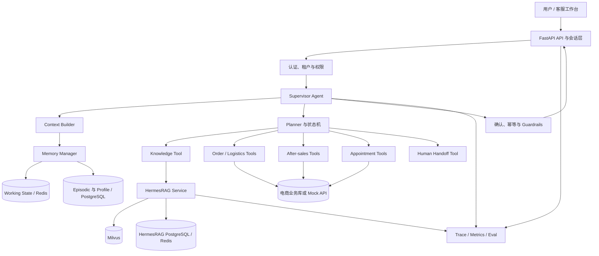
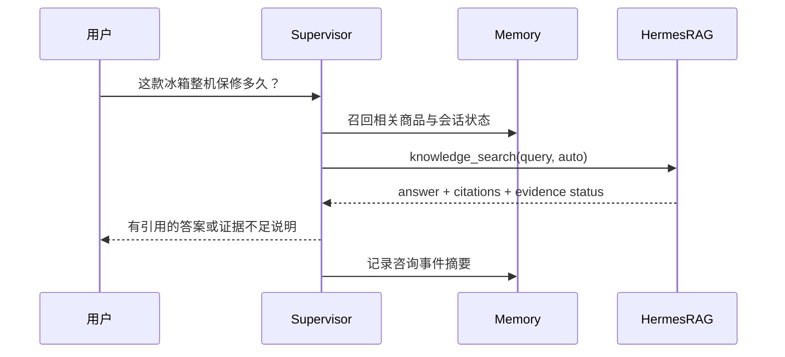
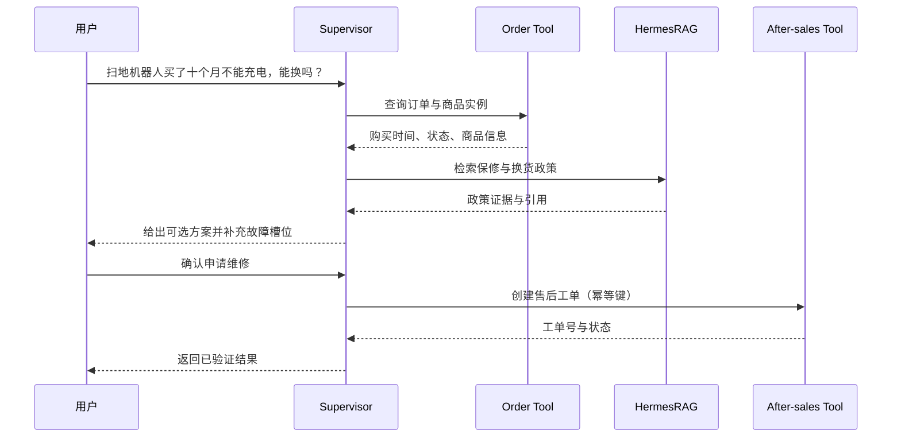

# JakePilot 电商售后 Agent 架构设计

- 状态：设计已确认，尚未进入代码实施
- 日期：2026-09-17
- 目标读者：项目开发者、技术面试官、评测人员
- 设计基线：JakePilot 负责 Agent 编排；HermesRAG 作为独立知识检索服务；记忆系统参考 Pico 的分层、按需召回和上下文预算思想，并按电商数据重新建模

## 1. 项目定义

JakePilot 是一个面向电商售后场景的多 Agent 服务平台。系统接收用户自然语言请求，在商品与政策咨询、订单查询、退换货办理、上门安装或维修预约四类业务之间识别意图，规划工具调用步骤，并在高风险写操作前要求用户确认。知识类问题由 HermesRAG 提供有证据、有引用、可追踪的回答；订单、退款、预约等实时事实通过业务工具查询和修改；记忆系统只保存当前任务状态、历史事件摘要和稳定偏好，不替代订单系统等事实源。

### 1.1 目标用户

- 电商平台消费者：咨询商品、订单、物流、售后政策和上门服务。
- 客服或售后人员：查看 Agent 执行轨迹、接管异常任务、处理转人工工单。
- 系统管理员：维护知识库、工具配置、权限和评测数据。

### 1.2 核心业务闭环

1. **商品与政策咨询**：回答商品使用、保修、退换货条件等问题并给出引用。
2. **订单与物流查询**：读取实时订单、支付和物流状态，不从记忆中猜测。
3. **退换货办理**：结合订单事实与政策证据判断资格，补齐原因、凭证等槽位，确认后创建售后单。
4. **上门服务预约**：针对安装、检测或维修，收集商品、地址区域、时间和服务类型，匹配可用时段并确认预约。

## 2. 范围与非范围

### 2.1 本期范围

- 基于结构化输出的意图识别和任务规划。
- 单意图与组合意图请求，例如“查物流，如果明天还不到就申请退款”。
- HermesRAG 知识检索工具，支持回答、引用、证据状态和 Trace 回传。
- 订单、物流、售后、预约、转人工等确定性工具。
- 写操作确认、幂等、超时、重试、失败回滚和安全降级。
- Working、Episodic、Profile 三层业务记忆。
- 上下文预算、记忆召回解释和全链路可观测性。
- 离线评测集与端到端任务评测。

### 2.2 明确不做

- 不训练或微调基础大模型。
- 不将 HermesRAG 的向量检索代码复制到 JakePilot 内部。
- 不让多个 Agent 自由聊天或无限循环协商。
- 不用记忆替代订单、物流、库存、退款等实时业务系统。
- 不自动执行付款、退款、取消订单等写操作，除非用户已确认且权限校验通过。
- 不保存银行卡号、证件原文、完整支付凭证等高敏感信息。
- 不在用户界面暴露模型隐藏思维链，只展示计划摘要、工具状态、证据和结果。

## 3. 架构原则

1. **Agent 决策，Tool 执行**：模型负责理解、规划和解释；确定性工具负责读取或修改业务状态。
2. **RAG 是知识工具**：HermesRAG 只解决知识证据问题，不承担订单和退款事实查询。
3. **事实源优先**：实时业务数据始终覆盖历史记忆和模型推断。
4. **写操作可控**：所有有副作用的操作经过权限、参数、确认和幂等检查。
5. **有界执行**：计划步数、工具重试、RAG 补检和模型调用都有上限。
6. **记忆可解释**：每条记忆可追溯到来源、时间、置信度和写入原因。
7. **降级而非伪造**：外部服务失败时返回可解释状态、追问或转人工，不伪造成功结果。

## 4. 总体架构



### 4.1 服务边界

| 服务 | 负责 | 不负责 |
|---|---|---|
| JakePilot | 会话、意图、任务计划、工具编排、状态、记忆、确认、异常恢复 | 文档切分、向量召回、RAG 重排 |
| HermesRAG | 文档入库、混合检索、Agentic 补检、证据判断、引用验证、RAG Trace | 订单读取、退款写入、预约落库 |
| 电商业务工具层 | 订单、物流、售后单、服务时段等事实读写 | 自然语言推理和政策解释 |
| Memory Manager | 任务状态、事件摘要、稳定偏好的写入与按需召回 | 作为订单状态或政策事实源 |

选择独立服务组合，而不是复制 HermesRAG 代码，原因是两个系统的职责、数据生命周期和扩展方向不同。JakePilot 通过稳定接口调用 HermesRAG，未来替换检索实现时不会破坏 Agent 业务流程。

## 5. 模块设计

### 5.1 API、认证与会话层

职责：

- 接收普通问答和流式请求。
- 解析 `user_id`、`tenant_id`、`session_id` 和角色。
- 创建请求级 `trace_id`，贯穿 Agent、工具和 HermesRAG。
- 限制输入长度、并发数和请求频率。
- 将管理员 Trace 与普通用户输出分离。

建议公开接口：

- `POST /api/chat`：提交消息并获得完整结果。
- `POST /api/chat/stream`：SSE 流式输出阶段状态和最终回答。
- `POST /api/actions/{action_id}/confirm`：确认退款、取消、预约等写操作。
- `GET /api/sessions/{session_id}`：读取会话摘要，不直接返回敏感内部状态。
- `POST /api/handoff`：主动转人工。

### 5.2 Supervisor Agent

Supervisor 是唯一的顶层编排者，负责：

- 判断单意图、组合意图和风险等级。
- 根据当前请求、Working Memory 和相关历史生成有界计划。
- 选择工具、校验工具前置条件、处理返回结果。
- 决定继续执行、追问、请求确认、降级或转人工。
- 输出用户可读的计划摘要，但不暴露隐藏思维链。

Planner 使用结构化结果，而不是自由文本：

```json
{
  "intents": ["order_query", "refund_request"],
  "risk_level": "write_confirmation_required",
  "missing_slots": ["refund_reason"],
  "steps": [
    {"tool": "get_order", "purpose": "读取实时订单状态"},
    {"tool": "knowledge_search", "purpose": "检索退款政策"},
    {"tool": "create_after_sales_case", "purpose": "用户确认后创建售后单"}
  ]
}
```

运行限制：单轮最多 6 个计划步骤；同一工具最多重试 1 次；需要补充信息时立即暂停计划；写工具只能在确认后执行。

### 5.3 Knowledge Tool：HermesRAG 适配器

JakePilot 不直接访问 Milvus，而是通过 `HermesRagClient` 调用 HermesRAG：

- 简单、明确的政策事实默认使用 `auto`，允许 HermesRAG 选择标准或 Agentic 链路。
- 多条件、跨文档、存在证据冲突或用户要求依据时显式使用 `agentic`。
- 调用时透传 `session_id` 和 `trace_id`，但不把完整用户画像写入知识库。
- 返回值必须包含回答、引用、流水线状态、终止原因和可选管理员 Trace。

内部统一结果：

```json
{
  "answer": "可在签收后七日内申请退货，但需满足商品完好条件。",
  "citations": [{"id": "E1", "source": "退换货政策"}],
  "pipeline_status": "ready",
  "evidence_sufficiency": "sufficient",
  "terminal_reason": "answer_ready"
}
```

处理约束：

- `ready`：允许作为政策证据参与业务判断。
- `partial_ready`：只回答已被证据覆盖的部分，并说明缺口。
- `insufficient_evidence`：追问、换检索条件或转人工，不把模型常识当成平台政策。
- `failed/degraded`：展示系统暂不可核验，禁止据此执行退款等写操作。

### 5.4 订单与物流工具

只提供确定性读取：

- `list_recent_orders(user_id)`
- `get_order(user_id, order_id)`
- `get_logistics(user_id, order_id)`
- `get_product_instance(user_id, order_id, item_id)`

所有工具在服务端根据登录身份限定数据范围，模型不能通过传入其他 `user_id` 越权查询。

### 5.5 售后工具

- `evaluate_after_sales_eligibility`：使用订单事实和结构化政策约束计算候选结论。
- `create_after_sales_case`：创建退货、换货、维修或退款工单。
- `upload_evidence_reference`：保存用户上传文件的引用，不在记忆中保存原文件内容。
- `cancel_after_sales_case`：仅在状态允许且用户二次确认后执行。

LLM 可以解释政策和收集原因，但最终资格判断需同时引用实时订单字段和 HermesRAG 返回的政策证据。

### 5.6 上门服务预约工具

将原 JakePilot 的预约能力迁移为电商售后服务：

- 原“服务项目”映射为安装、检测、维修。
- 原“技师偏好”改为工程师技能、服务区域和可用时段。
- 增加订单商品、故障类型、服务地址区域和联系方式引用。
- 预约落库前校验订单归属、服务资格和时段冲突。

工具包括：

- `list_service_slots(region, service_type, product_type, date_range)`
- `create_service_booking(order_id, slot_id, issue_summary)`
- `reschedule_service_booking(booking_id, slot_id)`
- `cancel_service_booking(booking_id)`

### 5.7 Human Handoff

满足以下条件之一时转人工：

- HermesRAG 找不到可核验政策，但任务需要政策依据。
- 用户争议金额、风险等级或权限超过 Agent 阈值。
- 外部工具连续失败或返回冲突状态。
- 用户明确要求人工客服。
- 模型无法稳定确定意图或关键槽位。

转人工包只包含必要摘要、已验证事实、引用和失败步骤，避免客服重新询问全部信息。

## 6. 记忆系统设计

### 6.1 为什么不能直接复制 Pico

Pico 保存任务摘要、最近文件、文件摘要和项目决策，服务于编程 Agent。JakePilot 的对象是用户、订单和售后任务，因此复用的是机制而不是字段：分层结构、按需召回、上下文预算、记忆晋升、冲突覆盖和可解释 Trace。

### 6.2 三层记忆

#### Working Memory

当前会话的任务状态：

- 当前意图与计划位置。
- 已选择订单和商品。
- 已收集槽位及确认状态。
- 最近工具结果的必要摘要。
- 待确认 Action 的 ID、参数摘要和过期时间。

建议存储在 Redis；开发环境可使用 PostgreSQL 或进程内替代。默认会话失活 30 分钟后过期，已创建业务单据不会随会话删除。

#### Episodic Memory

跨会话的事件摘要：

- 用户曾针对某订单咨询充电故障。
- 某次退货申请因超过期限转为维修。
- 某次预约失败后最终改约成功。

只保存事实摘要、业务实体 ID、结果、来源和时间，不保存完整聊天。退款、物流等动态状态再次使用时必须回源查询。

#### Profile Memory

稳定且可复用的用户偏好：

- 明确表达的沟通语言和通知方式。
- 上门服务时间偏好。
- 经用户确认的地址区域引用。
- 常见商品类别偏好。

“用户明确表达”和“系统行为推断”分开存储。推断偏好置信度不足时不得自动影响写操作。

### 6.3 数据模型

`working_states`：

- `tenant_id`、`user_id`、`session_id`
- `active_intent`、`plan_state`、`slots_json`
- `pending_action_json`、`version`
- `expires_at`、`updated_at`

`memory_events`：

- `event_id`、`tenant_id`、`user_id`
- `event_type`、`entity_refs_json`
- `summary`、`outcome`
- `source_trace_id`、`occurred_at`、`expires_at`

`user_profile_memories`：

- `memory_id`、`tenant_id`、`user_id`
- `memory_key`、`memory_value`
- `source_type`：`explicit` 或 `inferred`
- `confidence`、`source_trace_id`
- `valid_from`、`valid_until`、`superseded_by`

### 6.4 记忆读取

每轮规划前执行：

1. 按租户、用户和会话加载 Working Memory。
2. 根据订单 ID、商品类别、任务类型和关键词召回 Episodic Memory。
3. 加载与本轮任务相关的 Profile Memory。
4. 过滤已过期、被覆盖、来源不可信或置信度不足的记录。
5. 最多注入 3 条事件和 3 条偏好，并记录入选原因。

初期使用结构化过滤、标签命中、时间衰减和置信度排序，不另建第二套向量库。只有离线评测证明结构化召回不足时，才考虑增加语义向量召回。

### 6.5 记忆写入

- 用户消息先更新 Working Memory，不立即晋升长期记忆。
- 工具调用成功后写入 Episodic Memory；失败尝试只进入 Trace。
- 用户明确表达并确认的稳定偏好可直接写入 Profile Memory。
- 行为推断偏好至少需要两次一致事件，且以较低置信度写入。
- 新偏好与旧偏好冲突时创建新版本，并通过 `superseded_by` 标记旧记录。
- 用户可查看、修改和删除 Profile Memory。

### 6.6 上下文预算

发送给模型的上下文按以下顺序组装：

1. 系统规则与工具契约。
2. 当前任务状态和待确认操作。
3. 相关记忆。
4. 最近对话历史。
5. 当前用户请求。

当前请求、权限规则、待确认写操作和实时工具结果不可裁剪。超出预算时依次压缩旧对话、低置信度事件、非关键偏好，最终仍超限则生成会话摘要并开启新上下文窗口。

## 7. 端到端运行流程

### 7.1 商品或政策咨询



### 7.2 退换货办理



### 7.3 上门安装或维修预约

Supervisor 先确认订单与服务资格，再收集服务类型、区域和时间范围。候选时段只用于展示，用户选择后重新校验一次可用性，再创建预约。并发冲突时返回最新时段，不自动选择替代时间。

### 7.4 组合任务

“查物流，如果明天还不到就退款”包含查询和条件性写操作。系统只查询当前物流并解释退款条件，不提前创建退款。条件在未来满足时需要用户重新确认，避免把自然语言中的未来意图当成立即授权。

## 8. 安全、权限与一致性

### 8.1 写操作确认

待确认操作生成 `action_id`，保存参数摘要、调用者、版本号和过期时间。确认接口重新检查：

- 当前登录用户仍拥有相关订单。
- 订单或预约版本未变化。
- Action 未过期、未执行、参数未被篡改。
- 幂等键尚未产生成功结果。

### 8.2 多租户与隐私

- 所有业务表和记忆表带 `tenant_id`、`user_id`。
- Repository 层强制附加租户和用户过滤，不能依赖模型传参。
- Trace 对普通用户隐藏模型内部字段，对管理员仍需脱敏。
- 日志不记录 API Key、Token、完整地址和支付信息。

### 8.3 数据一致性

- 实时订单状态高于记忆和对话摘要。
- 创建售后单和预约使用数据库事务或业务 API 的幂等能力。
- 写工具超时后先按幂等键查询结果，再决定是否重试。
- 记忆写入失败不回滚已成功的业务操作，但记录补偿任务。

## 9. 异常与降级策略

| 故障 | 系统行为 |
|---|---|
| LLM 不可用 | 保留任务状态，返回稍后重试或转人工，不执行写操作 |
| HermesRAG 证据不足 | 追问限定条件、给出已证实部分或转人工 |
| HermesRAG 超时 | 一次短重试；仍失败则停止依赖政策的写操作 |
| 订单 API 超时 | 不从记忆猜订单状态，返回暂不可查询 |
| 写工具超时 | 使用幂等键查结果，避免重复创建 |
| Planner 输出非法 | 结构化校验失败后重试一次，再走安全降级 |
| 记忆冲突 | 以实时事实和用户最新明确表达为准，旧记忆标记失效 |
| 会话状态损坏 | 从最近成功 Checkpoint 恢复，无法恢复则保留业务事实并重建会话 |

## 10. Trace 与可观测性

每次请求生成统一 Trace：

- 路由意图、置信度和规划来源。
- 计划步骤数、实际执行步骤和终止原因。
- 工具名称、耗时、重试、参数校验和结果状态。
- HermesRAG 模式、证据充分性、引用状态和检索轮次。
- 记忆召回数量、来源、入选原因和是否被使用。
- Token、模型调用次数、总耗时和异常降级路径。

普通用户只看到“正在查询订单”“正在核验政策”等阶段信息；管理员可查看脱敏后的详细 Trace。

## 11. 评测设计

以下数字是实施后的验收门槛，不是当前已取得的项目结果。

### 11.1 数据集组成

离线集至少 200 条，包含：

- 40 条商品或政策咨询。
- 40 条订单与物流查询。
- 40 条退换货任务。
- 30 条上门服务预约。
- 20 条组合意图任务。
- 15 条记忆依赖任务。
- 15 条安全与异常控制样本。

订单、物流、售后和预约使用匿名 Mock 业务数据；知识问答使用具有明确再分发许可的公开商品问答或自建政策文档。公开数据集在实施计划前完成许可证核验，未核验的数据不得进入仓库。

### 11.2 指标

| 维度 | 指标 | 验收目标 |
|---|---|---:|
| 路由 | Intent Accuracy | ≥ 90% |
| 规划 | Plan Validity | ≥ 90% |
| 工具 | Tool Selection Accuracy | ≥ 90% |
| 工具 | Argument Exact Match | ≥ 85% |
| 业务 | End-to-End Task Success | ≥ 85% |
| 状态 | Slot Completion Accuracy | ≥ 90% |
| 记忆 | Memory Recall Precision@3 | ≥ 85% |
| 记忆 | Preference Consistency | ≥ 90% |
| RAG | Faithfulness | ≥ 0.90 |
| RAG | Citation Validity | ≥ 95% |
| 安全 | Unauthorized Write Rate | 0% |
| 安全 | Duplicate Write Rate | 0% |
| 性能 | 简单查询 P95 | ≤ 15 秒 |
| 性能 | 复杂 Agent 任务 P95 | ≤ 45 秒 |

### 11.3 Baseline

评测必须至少包含两个版本：

1. **LLM + 单轮工具调用 Baseline**：无结构化 Planner、无长期记忆，知识咨询使用标准 RAG。
2. **JakePilot Agent**：结构化 Planner、状态机、分层记忆、HermesRAG Auto/Agentic、确认与异常恢复。

比较任务成功率、工具选择、参数准确率、记忆一致性、RAG 质量、延迟和模型调用成本。最终简历只使用实际运行产生且能复现的指标。

## 12. 可独立交付的实施阶段

### 阶段一：电商工具闭环

将现有咨询和预约流程映射为订单、售后和上门服务，使用匿名 Mock 数据打通查询、确认和写入。即使后续阶段不实施，本阶段仍可演示完整业务任务。

### 阶段二：HermesRAG 工具化

新增独立适配器和统一响应契约，打通知识回答、引用和证据状态。HermesRAG 不可用时，阶段一的订单和预约工具仍可运行。

### 阶段三：分层记忆

增加 Working、Episodic、Profile Memory，完成跨会话召回、冲突覆盖、过期和上下文预算。关闭记忆开关时，阶段一和阶段二仍可运行。

### 阶段四：评测与展示

构建离线集、Baseline、自动评测和管理员 Trace 页面。评测组件不进入线上业务写路径，失败时不影响主系统运行。

## 13. 关键取舍

### 13.1 不采用自由协作式多 Agent

自由对话式多 Agent 难以限制调用次数、定位失败原因和保证写操作安全。本设计使用一个 Supervisor 加多个领域 Tool/受控 Agent，既能体现 Agent 规划，也便于测试。

### 13.2 不为记忆单独建设向量库

初期记忆规模小且高度结构化，按用户、实体、类型、标签、时间和置信度即可召回。先验证结构化召回的不足，再决定是否引入向量检索，避免与 HermesRAG 的 Milvus 能力重复。

### 13.3 不把所有问题都送入 Agentic RAG

简单政策事实使用 Auto 或标准检索以控制延迟；跨文档、条件复杂、证据冲突的问题才使用 Agentic 模式。Supervisor 根据任务风险和证据需求选择模式。

## 14. 最脆弱的假设与应对

本设计假设 HermesRAG 能通过稳定的本地 HTTP 接口返回回答、引用和流水线状态。如果这一接口不能保持兼容，Knowledge Tool 会成为集成瓶颈。应对方式是让 JakePilot 只依赖内部 `KnowledgeResult` 契约，并把 HermesRAG 字段映射限制在适配器内部；接口变化时只修改适配器，不改 Supervisor 和业务工具。

## 15. 已知风险

- 当前 JakePilot 基线以单用户、进程内状态和 SQLite 为主，需要先消除全局 Session 和单用户假设。
- 当前测试会直接初始化外部模型，不具备完整离线 Mock，需要补充分层测试。
- 原始导入项目未提供明确 LICENSE；公开展示时保留来源说明，商业再分发前需获得授权。
- HermesRAG 与 JakePilot 都有会话概念，必须明确 JakePilot 是主会话，HermesRAG 只接收映射后的检索会话 ID。
- 多轮写操作如果没有版本号和幂等键，会出现重复退款或重复预约风险。

## 16. 简历口径约束

在实现和评测完成前，简历可以描述“设计”或“规划”，不能写成已经实现，也不能填写模拟指标。最终简历建议压缩为四条：

1. 电商售后业务与多 Agent 编排。
2. 订单、售后、预约工具和安全执行闭环。
3. HermesRAG 知识工具与证据约束。
4. 分层记忆、评测结果和工程指标。

HermesRAG 在本项目中只作为知识模块介绍；其完整检索架构和专项指标仍放在独立 HermesRAG 项目中，避免两段项目经历重复。

## 17. 设计完成标准

当以下条件全部满足，才进入实现计划：

- 业务范围保持为咨询、订单、退换货、上门服务四类。
- JakePilot 与 HermesRAG 使用独立服务和适配器契约。
- 写操作确认、幂等和事实源优先原则不被弱化。
- 记忆使用三层业务模型，不复制 Pico 的文件字段。
- 评测指标明确区分验收目标与实测结果。
- 用户审阅并确认本文档。
